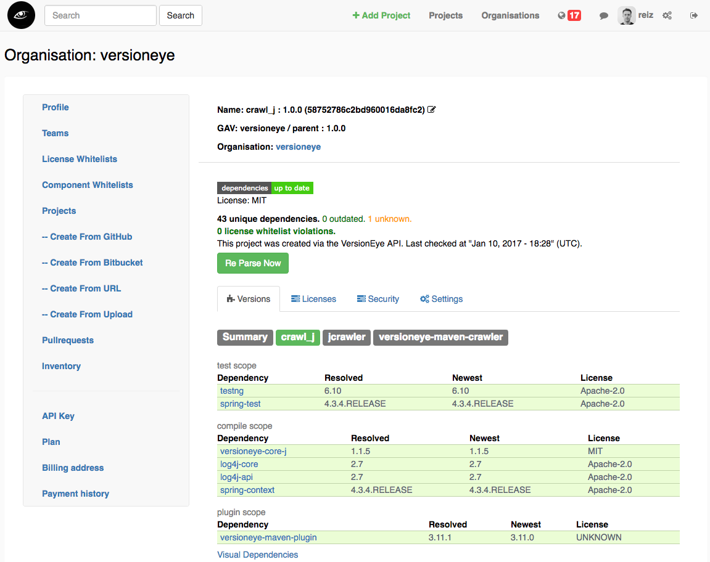

[](http://www.versioneye.com/user/projects/51e2af93cbe2eb000203df22)

# VersionEye Maven Plugin

The [maven](http://maven.apache.org/) plugin for [VersionEye](http://www.versioneye.com) helps you to create or update a project at VersionEye.
VersionEye is a platform for Continuous Updating. It will help you to keep your projects up-to-date and automatically notify you about outdated dependencies. You can check it out here: [www.versioneye.com](http://www.versioneye.com).

## Install

The VersionEye Maven plugin is available on the [Maven Central Repository](http://search.maven.org).
That means Maven will find it automatically, without adding any other
repositories! And you can find the project on [bintray](https://bintray.com/versioneye/versioneye/versioneye-maven-plugin/)
as well. 

Switch to the project where you want to use this plugin.
You can add the plugin to your project by adding this snippet to your
`pom.xml` file.

```
<build>
  <plugins>
    <plugin>
      <groupId>com.versioneye</groupId>
      <artifactId>versioneye-maven-plugin</artifactId>
      <version>2.0.1</version>
    </plugin>
  </plugins>
</build>
```
That's it. The plugin is installed and added to your project. Alternatively you can add `versioneye` to the plugin group search path. You do this by adding
```
<pluginGroups>
  <pluginGroup>com.versioneye</pluginGroup>
</pluginGroups>
```
to the user's Maven settings file (`~/.m2/settings.xml`). This will allow to use the `versioneye:*`
command line goals interactively in all projects.

## Install from source

If you wanna install the plugin from source, you have to follow this steps.

```
git clone https://github.com/versioneye/versioneye_maven_plugin.git
```

Switch to the root directory of the project:

```
cd versioneye_maven_plugin
```

And install it in your local maven repository:

```
mvn clean install
```

Now the plugin is installed on your local machine!


## Getting Started

You can check out all goals like this

```
mvn versioneye:help
```
That will output all possible goals on the versioneye plugin.

Now you can check if the [VersionEye API](https://www.versioneye.com/api?version=v2) is available:

```
mvn versioneye:ping
```
That should return an output like this:

```
{"success":true,"message":"pong"}
```

Now try this:

```
mvn versioneye:list
```

That will get you a list with all your direct and recursive dependencies and it will tell you how many dependencies you have in your project altogether.

Here you can convert your `pom.xml` to a `pom.json`

```
mvn versioneye:json
```
It will take all your direct dependencies and convert them into `/target/pom.json`. This is just for fun! You don't really need it, but I thought it's fun to write a small `pom.xml` to `pom.json` converter :-)

## API Key

This plugin can push your dependencies to the VersionEye API, create a project at VersionEye and tell you which of your dependencies are outdated. VersionEye will automatically check your project and notify you about outdated dependencies. You can use some of the resources at the VersionEye API without an *API KEY*, but for the project resource you need one. If you are [signed up](https://www.versioneye.com/signup) you can find your *API KEY* here: [https://www.versioneye.com/settings/api](https://www.versioneye.com/settings/api).


If you have your *API KEY*, create a properties file and add your key like this:

```
echo "api_key=YOUR_API_KEY" > versioneye.properties
```

The versioneye-maven-plugin will look at this places for the `versioneye.properties` file:

```
/src/qa/resources/versioneye.properties
```

If it can't find the file there it will look it up at this place:

```
src/main/resources/versioneye.properties
```

If you want so you can configure another place for the versioneye.properties file. Just set the path explicitly in the pom.xml on the versioneye plugin configuration:

```
<build>
  <plugins>
    <plugin>
      <groupId>com.versioneye</groupId>
      <artifactId>versioneye-maven-plugin</artifactId>
      <version>2.0.1</version>
      <configuration>
	    <propertiesPath>${basedir}/versioneye.properties</propertiesPath>
	  </configuration>
    </plugin>
  </plugins>
</build>

```

If the plugin can't find the API KEY in any of this locations it will look it up at this place:

```
~/.m2/versioneye.properties
```

That means if you don't want to commit your *API KEY* to the server and share it with your team you can place the file in your *home* directory and keep it for you.

## Create

If your *API KEY* is in place you can create a project at VersionEye based on the dependencies in your `pom.xml`. Just execute this:

```
mvn versioneye:create
```

This command will **not** change your local project. It just sends your dependencies to the VersionEye server and creates, based on that, a project at [www.versioneye.com](http://www.versioneye.com). If everything went right you will see in the output the URL to your new created VersionEye project. Just copy and paste it into you browser to check it out. Here is an example how it could look like:



Besides that, the plugin will add a `project_id` and `project_key` to the `versioneye.properties` file. The `project_id` is the connection between your `pom.xml` and the VersionEye project. If the `versioneye.properties` file doesn't exist yet, it will be created now.

## Update

With this command here you can update an existing VersionEye project:

```
mvn versioneye:update
```
That will simply update the existing VersionEye project with the dependencies from your `pom.xml`. It will **not** change your `pom.xml`.

By the way. If you don't like to have a `versioneye.properties` file you can set the project_id explicitly in the pom.xml. Just like this:

```
<build>
  <plugins>
    <plugin>
      <groupId>com.versioneye</groupId>
      <artifactId>versioneye-maven-plugin</artifactId>
      <version>2.0.1</version>
      <configuration>
	    <projectId>_YOUR_VERSONEYE_PROJECT_ID_</projectId>
	  </configuration>
    </plugin>
  </plugins>
</build>
```

## Feedback

If you have questions, find bugs or feature requests to this project, feel free to open a ticket [here](https://github.com/versioneye/versioneye_maven_plugin/issues). Pull Requests are welcome!

## License

[MIT](http://choosealicense.com/licenses/mit/)
